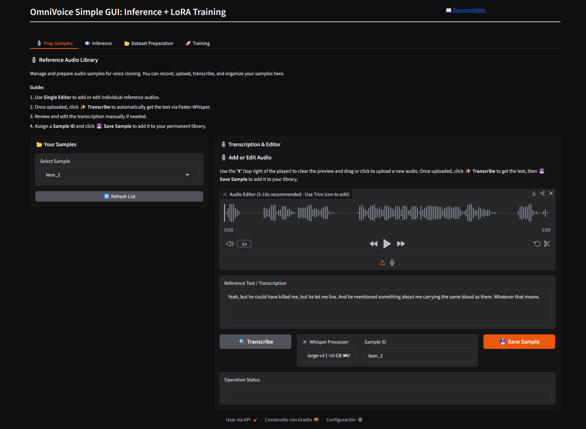
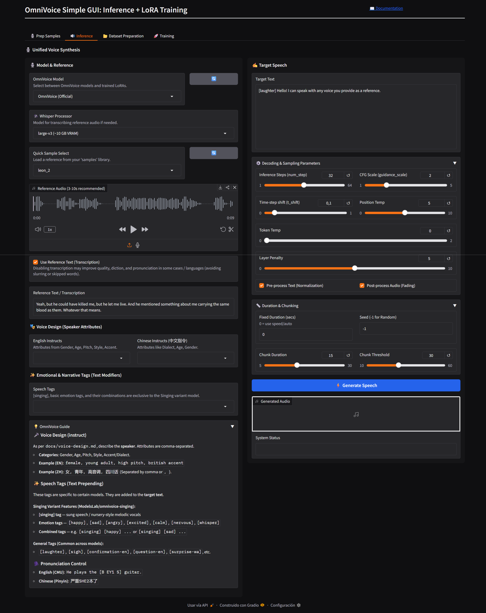
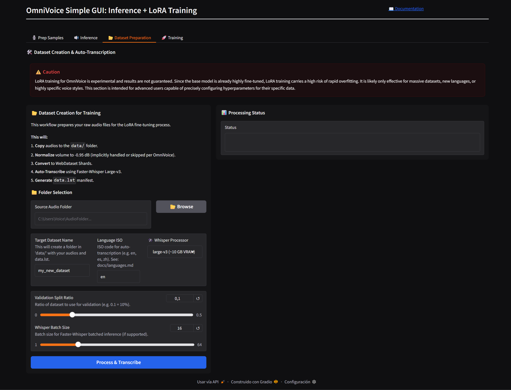
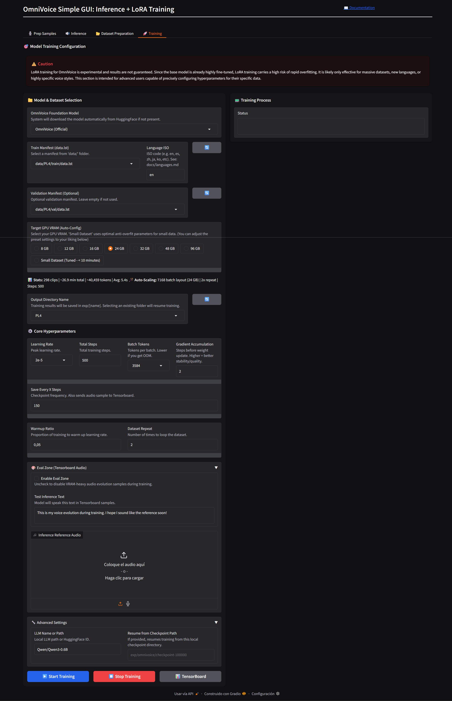

# 🎙️ OmniVoice Simple GUI: Unified Voice Cloning & Fine-Tuning

A comprehensive and optimized WebUI for working with **OmniVoice** on Windows. This application provides a seamless pipeline for dataset preparation, model training (LoRA), and high-quality voice synthesis.

---









## 🔄 Application Workflow

The GUI is designed around a 4-step logical workflow:

1.  **Prep Samples:** Build your library of reference voices. Import audio, trim it to the recommended 3-10s, and generate high-quality transcriptions using `Faster-Whisper`.
2.  **Dataset Preparation:** Convert a folder of raw audio files into a training-ready WebDataset. It automatically handles splitting (Train/Val), multi-lingual transcription (VAD-aware), and audio token extraction.
3.  **Training (LoRA):** Run experimental LoRA fine-tuning with **Auto-Optimize** logic. The system analyzes your dataset size and VRAM to calculate optimal Learning Rates, Steps, and Batch layouts exponentially.
4.  **Inference:** Generate speech with the base models or your trained LoRAs. Supports advanced "Instruct" prompts, emotion tags, and singing variations.

---

## ⚙️ System Requirements & Hardware

### 💻 Software Dependencies
*   **OS:** Windows 10/11.
*   **Python:** 3.10 – 3.11.
*   **Cuda:** 12.1+ recommended.
*   **VRAM Management:** The UI includes safety margins for all presets to prevent OOM errors during training.

### 🔌 Hardware Setup (VRAM Estimates)

| Feature | Minimum VRAM | Recommended |
| :--- | :--- | :--- |
| **Inference (Base)** | 8 GB | 12 GB+ |
| **Training (LoRA)** | 8 GB | 12 GB+ |
| **Whisper (ASR)** | 1 GB (Tiny) | 10 GB (Large-v3) |

---

## 📊 Dataset & Training Specifications

### 🎯 Training Audio Requirements
*   **Duration:** **3–10 seconds** per clip is ideal for stability.
*   **Total Volume:** 
    *   *Small Datasets (< 10 min):* Handled with an ultra-stable "Small Dataset" preset.
    *   *Large Datasets:* Parameters grow exponentially to maximize high-volume data learning.
*   **Quality:** Higher quality, clean audio (no background noise) leads to significantly better cloning.

### ✨ Key Features
*   **Auto-Optimize:** Automatically calculates training parameters based on your selected GPU VRAM and real dataset statistics (scanned from shards).
*   **Whisper Integration:** Per-tab Whisper selection allows you to balance speed vs. quality for different tasks.
*   **Voice Library:** Persistent storage of reference samples in the `samples/` directory for quick access during inference.

---

## 🛠️ Installation & Execution (Windows)

This project uses `uv` for high-performance dependency management.

## Clone the repository:

```bash
git clone https://github.com/Mixomo/OmniVoice_Simple_GUI.git
```

### Setup Steps
1.  **Run Installer:** Double-click `install.bat`.
    * This installs `uv` via Winget (if not present).
    * Synchronizes the environment and installs all required libraries automatically.
2.  **Launch App:** Double-click `start.bat`.
3.  **Access:** Navigate to `http://127.0.0.1:7860` in your web browser.

---

Inspired by [FranckyB](https://github.com/FranckyB) [Voice Clone Studio](https://github.com/FranckyB/Voice-Clone-Studio)

Based on [OmniVoice](https://github.com/k2-fsa/OmniVoice) by [K2-FSA](https://github.com/k2-fsa)

