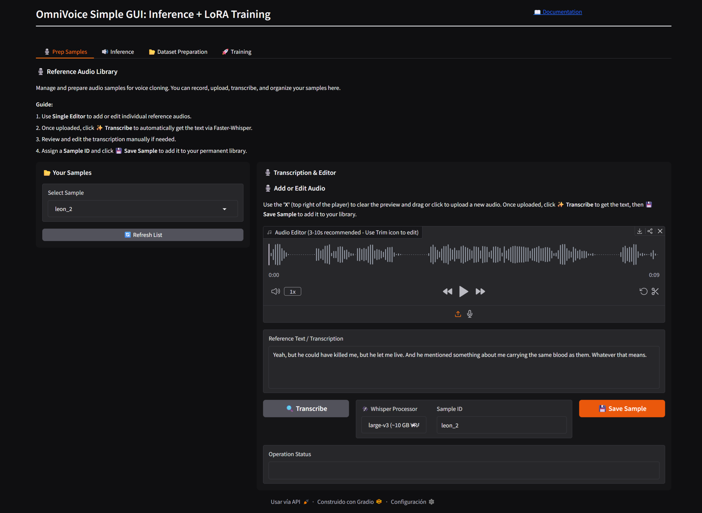
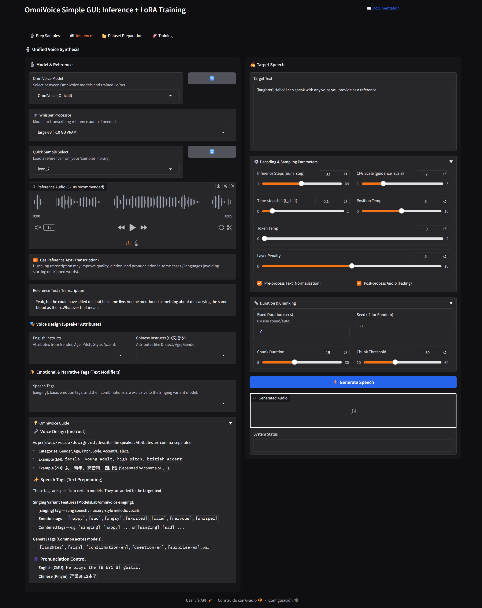
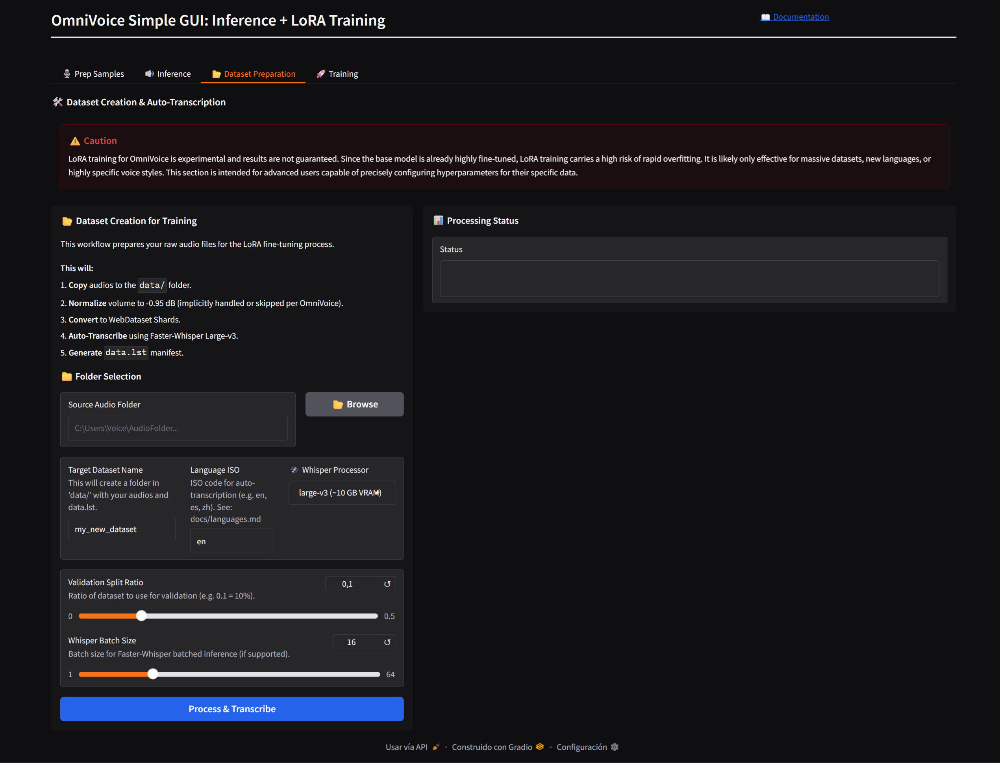
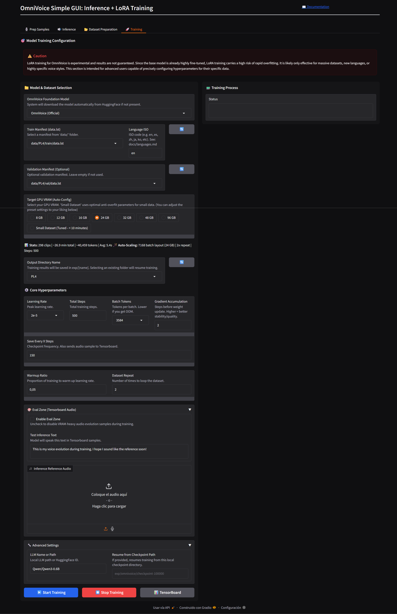
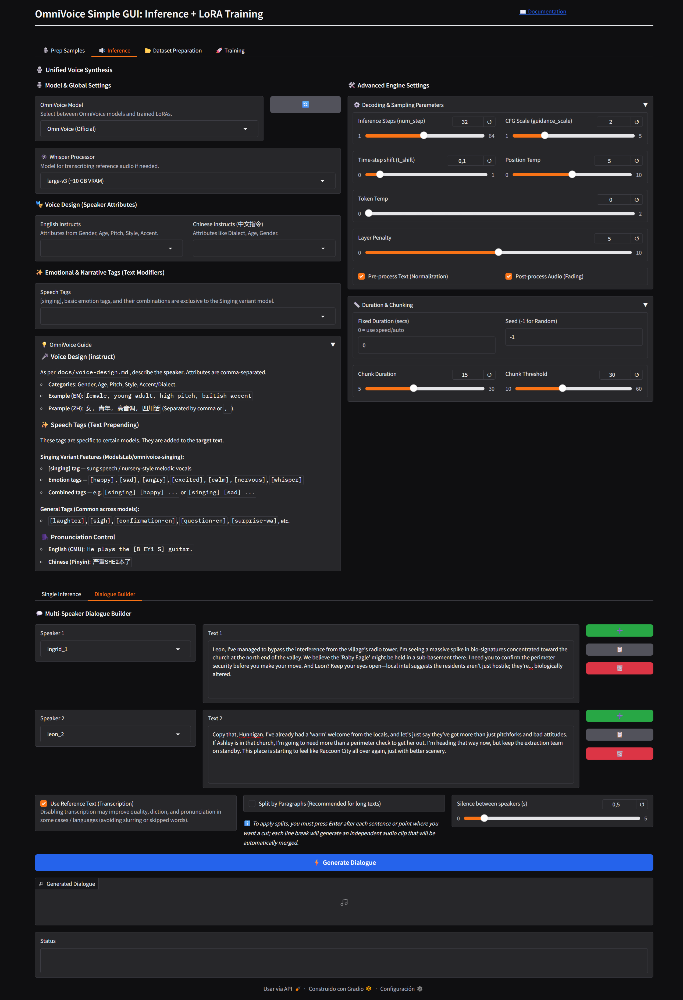

# 🎙️ OmniVoice Simple GUI: Unified Voice Cloning & Fine-Tuning

A comprehensive and optimized WebUI for working with **OmniVoice** on Windows. This application provides a seamless pipeline for dataset preparation, model training (LoRA), and high-quality voice synthesis.

---









### 2026-05-02 - Training Resume, Built-In Voice & Inference UX Update
This update improves LoRA training workflows, safer checkpoint resume, and inference controls based on real-world issue triage:

*   **Built-In Voice LoRA Conditioning**:
    *   Added **LoRA Conditioning Mode** in Training.
    *   **Reference-guided voice cloning** keeps the normal OmniVoice behavior, where inference is expected to use a reference voice sample.
    *   **Built-in voice (no reference prompt)** sets `prompt_ratio_range` to `[0.0, 0.0]`, training the dataset voice as the default LoRA voice for inference without reference audio.
    *   TensorBoard Eval Zone now respects this mode: built-in voice validation generates audio from `eval_text` only, without requiring `eval_ref_audio` or `eval_ref_text`.
*   **Training Project Recovery & Resume UX**:
    *   The **Output Directory Name** dropdown now doubles as a project selector.
    *   Selecting an existing `exp/` project reloads saved training settings from `train_config.json` and `data_config.json` into the GUI.
    *   Added a refresh button for **Resume from Checkpoint Path**.
    *   Project loading updates resume choices but leaves resume set to **None**, so users can retrain from scratch unless they explicitly choose a checkpoint.
*   **Checkpoint Resume Stability**:
    *   Fixed checkpoints being polluted by inference-only modules during TensorBoard audio generation.
    *   Checkpoint saving now strips temporary inference attributes such as `audio_tokenizer` before saving.
    *   Resume now automatically sanitizes older affected checkpoints by removing unexpected `audio_tokenizer.*` keys, keeping a `.bak` copy of the original file.
*   **Inference Text & Voice Consistency**:
    *   Removed the old global punctuation workaround that inserted spaces before `.`, `,`, `!`, `?`, etc., because it could make some models pronounce punctuation literally.
    *   Added safer inference text normalization that collapses whitespace and removes spaces before punctuation.
    *   For `Split by Paragraphs` in instruct/auto voice mode without a reference sample, the first generated clip is reused internally as the reference for later paragraphs to improve voice consistency.
*   **Advanced Inference UI Cleanup**:
    *   Added short explanations to decoding, sampling, duration, and chunking controls.
    *   Set **Post-process Audio** default to off to avoid unwanted fading/trimming unless users opt in.
    *   Added guidance explaining that Voice Design and tag selectors are quick starting points; for maximum control, users should write tags and instructions manually in the target text where needed.

### 2026-04-26 - Stability & Democratization Update: Pascal Support & VRAM Fixes
This massive update focuses on making OmniVoice stable for long training sessions and accessible to a wider range of NVIDIA GPUs:

*   **VRAM Leak Resolution**: 
    *   Forced **PyTorch 2.7.1** downgrade to eliminate memory leaks present in newer versions.
    *   Enabled `expandable_segments` memory allocator and deep VRAM purging (CPU offloading before deletion) in both inference and training.
*   **OmniTrainer 2.0**:
    *   **Infinite Dataloader**: Replaced epoch-based resetting with a linear "infinite" stream to prevent training stalls.
    *   **Safe Evaluation**: Implemented model-only offloading during validation to preserve optimizer state in VRAM, preventing fragmentation.
    *   **RNG Persistence**: Fixed random state handling so validation samples no longer disrupt training reproducibility.
*   **Hardware Democratization & Flex Attention**:
    *   **Architecture-Aware Patching**: Implemented a Compute Capability detection system. **Ampere (RTX 30)** and **Ada (RTX 40)** GPUs have a physical **99KB shared memory limit** per block.
    *   **32x32 Block Fix**: We force 32x32 blocks during training for these architectures to prevent `CUDA illegal memory access` errors that occur when PyTorch attempts to use default 128x128 blocks.
    *   **Unrestricted Inference**: The patch is automatically disabled during inference to regain maximum speed with large blocks, as shared memory is not saturated without gradient calculations.
    *   **Pascal Support (10-Series)**: Auto-detects legacy GPUs to install **PyTorch 2.6.0 + CUDA 12.6**, maintaining compatibility where newer versions fail.
*   **Enhanced UI & UX**:
    *   **Smart Hyperparameter Recipe**: Replaced old heuristics with a "Small-Dataset" tuned config (LR 1e-5, Accum 2) that avoids catastrophic overfitting.
    *   **Reactive VRAM Presets**: Choosing a VRAM preset (8GB to 32GB+) now instantly updates all parameters without extra clicks.
    *   **Dynamic Checkpoint Resume**: Replaced the manual path textbox with a searchable dropdown of existing projects and checkpoints.
*   **Robust Windows Support**:
    *   Fixed multiprocessing `PicklingError` in Windows DataLoaders.
    *   Patched Triton/Inductor `CompiledKernel` hooks for stable Windows execution.
    *   Improved **TensorBoard** integration with automatic port cleanup and visible console logging.

## 🛠️ Windows Deep-Dive: The `windows_patch.py` System
To enable high-performance features like **Flex Attention** and **Triton compilation** on Windows, we implement a series of low-level monkey-patches in `omnivoice/utils/windows_patch.py`. Here is a breakdown of every fix applied:

### 1. `apply_triton_windows_patch()`: Bridging the OS Gap
Triton is natively built for Linux. Windows wheels (like `triton-windows`) often lack specific metadata or hooks that PyTorch Inductor expects.
*   **Metadata Injection (`make_launcher`)**: We patch `TritonCompileResult.make_launcher` to intercept the kernel binary. It manually injects `cluster_dims` and `num_ctas` into the `binary.metadata` if they are missing. Without this, the compiler throws an `AttributeError` because it expects these fields for hardware synchronization.
*   **CompiledKernel Hooks**: In PyTorch 2.6/2.7, Inductor looks for `launch_enter_hook` and `launch_exit_hook` on the `CompiledKernel` class. Since these are often absent in Windows Triton builds, we inject dummy lambda functions to prevent a crash during the kernel launch phase.

### 2. `apply_flex_attention_patch()`: Overcoming Hardware Limits
Standard Flex Attention kernels are optimized for A100/H100 GPUs with large shared memory. Consumer cards have a **99KB shared memory limit** per block.
*   **Architecture Detection**: The patch uses `torch.cuda.get_device_capability()` to target **Ampere (8.6)** and **Ada (8.9)** GPUs specifically.
*   **Kernel Option Overrides**: It wraps `compile_friendly_flex_attention` to force `BLOCK_M=32` and `BLOCK_N=32`. 
*   **The Rationale**: Default 128x128 blocks require >100KB of shared memory during training (due to gradient overhead). Forcing 32x32 blocks reduces shared memory pressure to ~40KB, allowing training to run stably without `CUDA Error: illegal memory access`.

### 3. `patch_triton_key()`: Cache & Hash Stability
*   This patch modifies the internal hashing mechanism used by Inductor to identify Triton kernels. It ensures that `num_ctas` is always present in the signature, preventing cache misses and "KeyError" crashes when the compiler tries to retrieve a compiled kernel from the local disk cache on Windows.

### 2026-04-24 - Add Dialogue Builder - Multi Speaker Support Inference
We've introduced a **Dialogue Builder** sub-tab within the Voice Clone interface, designed for creating multi-speaker interactions easily:

*   **Dynamic Row Management**: Effortlessly build dialogues by adding (`➕`), cloning (`📋`), or removing (`🗑️`) speaker segments. 
*   **Multi-Speaker Support**: Assign a different voice sample and custom text to every segment in the conversation.
*   **Sequential Synthesis**: Generates each segment independently using the shared global settings (Engine, Model, Temperature, etc.) and automatically concatenates them.
*   **Customizable Silences**: Control the natural flow of the conversation with a dedicated slider to adjust the duration of silence (0 to 5 seconds) between each speaker.
*   **Internal Audio Mastering**: Every output is automatically volume normalized before rendering, ensuring professional consistency across all segments.



## 🔄 Application Workflow

The GUI is designed around a 4-step logical workflow:

1.  **Prep Samples:** Build your library of reference voices. Import audio, trim it to the recommended 3-10s, and generate high-quality transcriptions using `Faster-Whisper`.
2.  **Dataset Preparation:** Convert a folder of raw audio files into a training-ready WebDataset. It automatically handles splitting (Train/Val), multi-lingual transcription (VAD-aware), and audio token extraction.
3.  **Training (LoRA):** Run experimental LoRA fine-tuning with **Auto-Optimize** logic. The system analyzes your dataset size and VRAM to calculate optimal Learning Rates, Steps, and Batch layouts exponentially.
4.  **Inference:** Generate speech with the base models or your trained LoRAs. Supports advanced "Instruct" prompts, emotion tags, and singing variations.

---

## ⚙️ System Requirements & Hardware

### 💻 Software Dependencies
*   **OS:** Windows 10/11.
*   **Python:** 3.10 – 3.11.
*   **Cuda:** 12.1+ recommended.
*   **VRAM Management:** The UI includes safety margins for all presets to prevent OOM errors during training.

### 🔌 Hardware Setup (VRAM Estimates)

| Feature | Minimum VRAM | Recommended |
| :--- | :--- | :--- |
| **Inference (Base)** | 8 GB | 12 GB+ |
| **Training (LoRA)** | 8 GB | 12 GB+ |
| **Whisper (ASR)** | 1 GB (Tiny) | 10 GB (Large-v3) |

---

## 📊 Dataset & Training Specifications

### 🎯 Training Audio Requirements
*   **Duration:** **3–10 seconds** per clip is ideal for stability.
*   **Total Volume:** 
    *   *Small Datasets (< 10 min):* Handled with an ultra-stable "Small Dataset" preset.
    *   *Large Datasets:* Parameters grow exponentially to maximize high-volume data learning.
*   **Quality:** Higher quality, clean audio (no background noise) leads to significantly better cloning.

### ✨ Key Features
*   **Auto-Optimize:** Automatically calculates training parameters based on your selected GPU VRAM and real dataset statistics (scanned from shards).
*   **Whisper Integration:** Per-tab Whisper selection allows you to balance speed vs. quality for different tasks.
*   **Voice Library:** Persistent storage of reference samples in the `samples/` directory for quick access during inference.

---

## 🛠️ Installation & Execution (Windows)

This project uses `uv` for high-performance dependency management.

## Clone the repository:

```bash
git clone https://github.com/Mixomo/OmniVoice_Simple_GUI.git
```

### Setup Steps
1.  **Run Installer:** Double-click `install.bat`.
    * This installs `uv` via Winget (if not present).
    * Synchronizes the environment and installs all required libraries automatically.
2.  **Launch App:** Double-click `start.bat`.
3.  **Access:** Navigate to `http://127.0.0.1:7860` in your web browser.

---

Inspired by [FranckyB](https://github.com/FranckyB) [Voice Clone Studio](https://github.com/FranckyB/Voice-Clone-Studio)

Based on [OmniVoice](https://github.com/k2-fsa/OmniVoice) by [K2-FSA](https://github.com/k2-fsa)
